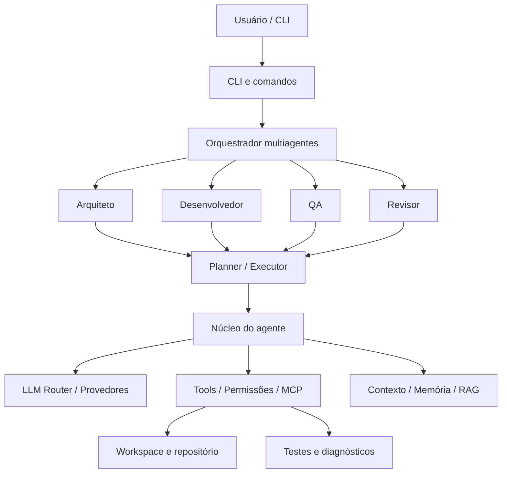
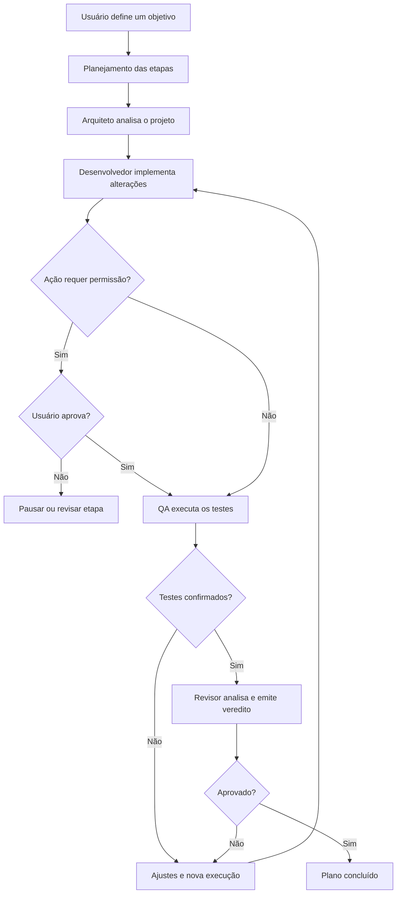

<div align="center">

# ⚡ Tesla Agent

### Um agente de IA para desenvolvimento de software e automações, construído em Python com um harness próprio.

**Da primeira CLI à orquestração multiagentes — um projeto documentado versão por versão.**

[](https://www.python.org/)
[](versions/v0.6.0/README.md)
[](#-roadmap)

**Criado e desenvolvido por Guilherme Hendrik**

[](https://github.com/MrHendrix0611)
[](https://www.linkedin.com/in/guilherme-hendrik-59775326a/)
[](https://www.instagram.com/hxtech_/)

[Sobre](#-sobre-o-projeto) · [Funcionalidades](#-funcionalidades) · [Versões](#-histórico-de-versões) · [Instalação](#-como-executar) · [Arquitetura](#-arquitetura) · [Roadmap](#-roadmap)

</div>

---

## 💡 Sobre o projeto

O **Tesla Agent** nasceu de uma pergunta: **até onde um modelo de IA pequeno ou gratuito pode chegar quando trabalha com um harness bem estruturado?**

Minha proposta é demonstrar, na prática, que a qualidade de um agente não depende apenas do tamanho ou da capacidade isolada do modelo. **Arquitetura, contexto, ferramentas, planejamento, verificações e controle de execução** também influenciam diretamente a qualidade das entregas.

O projeto começou como uma aplicação simples de linha de comando, inicialmente chamada **Hefesto Agent**, e evoluiu para o **Tesla Agent**: um agente voltado ao desenvolvimento de software e à automação de tarefas, com memória, integração com ferramentas externas e orquestração de papéis especializados.

Este repositório reúne os **snapshots de código e a documentação de cada versão**, desde a **v0.1 até a v0.6.0**, para que qualquer pessoa possa estudar como a arquitetura foi evoluindo — incluindo decisões, recursos implementados e limitações.

> **Estado atual:** projeto experimental e em desenvolvimento. A v0.6.0 é a versão mais recente documentada neste repositório; as versões anteriores permanecem disponíveis para estudo e comparação.

## 🎯 Objetivos

- Investigar como **harness engineering** pode aumentar a utilidade prática de modelos pequenos e gratuitos.
- Construir um agente de desenvolvimento com **arquitetura modular, extensível e auditável**.
- Integrar diferentes provedores de LLM sem depender de um único serviço.
- Automatizar tarefas de programação preservando **permissões, testes e revisão humana**.
- Registrar a evolução do projeto de forma aberta, do protótipo inicial a uma futura aplicação com interface própria.

## 🧩 Funcionalidades

| Capacidade | O que oferece |
|---|---|
| **CLI interativa** | Conversa com o agente e execução de comandos locais. |
| **Múltiplos modelos** | Integração com diferentes provedores, incluindo opções locais e remotas conforme a configuração da versão. |
| **Smart Router** | Seleção de modelos, fallback e acompanhamento de uso. |
| **Skills e Tools** | Especialização por instruções e uso controlado de ferramentas. |
| **Permissões** | Confirmação de operações com impacto no ambiente e controle de uso pago. |
| **Repository Intelligence** | Navegação, busca e identificação de símbolos no código. |
| **Planner e Executor** | Planejamento em etapas, checkpoints e retomada da execução. |
| **Coding Agent** | Operações de edição, visualização de diffs, rollback e testes. |
| **Memória e RAG** | Registro de decisões e recuperação de contexto do projeto. |
| **MCP** | Comunicação com servidores de ferramentas externas via stdio. |
| **Multiagentes** | Fluxo de Arquiteto, Desenvolvedor, QA e Revisor. |
| **Observabilidade** | Informações de consumo, decisões e auditoria das operações. |

> A disponibilidade de cada funcionalidade **depende da versão**. Consulte o README do snapshot para conhecer os comandos e o escopo exato daquela implementação.

## 📚 Histórico de versões

| Versão | Principal evolução | Código e documentação |
|:---|---|---|
| **v0.1** | Fundação do agente e CLI | [Explorar v0.1](versions/v0.1/README.md) |
| **v0.2** | Seleção de provedores | [Explorar v0.2](versions/v0.2/README.md) |
| **v0.3** | Contexto conversacional | [Explorar v0.3](versions/v0.3/README.md) |
| **v0.4** | Skills especializadas | [Explorar v0.4](versions/v0.4/README.md) |
| **v0.5** | Tools, permissões e execução | [Explorar v0.5](versions/v0.5/README.md) |
| **v0.5.1** | Multi-LLM e fallback | [Explorar v0.5.1](versions/v0.5.1/README.md) |
| **v0.5.2** | Smart Router e controle de uso | [Explorar v0.5.2](versions/v0.5.2/README.md) |
| **v0.5.3** | Aprovação de modelos pagos | [Explorar v0.5.3](versions/v0.5.3/README.md) |
| **v0.5.4** | Observabilidade e auditoria | [Explorar v0.5.4](versions/v0.5.4/README.md) |
| **v0.5.5** | Repository Intelligence e identidade Tesla | [Explorar v0.5.5](versions/v0.5.5/README.md) |
| **v0.5.6** | Planner, Executor e checkpoints | [Explorar v0.5.6](versions/v0.5.6/README.md) |
| **v0.5.7** | Coding Agent: diff, rollback e testes | [Explorar v0.5.7](versions/v0.5.7/README.md) |
| **v0.5.8** | Memória de projeto e RAG lexical | [Explorar v0.5.8](versions/v0.5.8/README.md) |
| **v0.5.9** | Integração MCP via stdio | [Explorar v0.5.9](versions/v0.5.9/README.md) |
| **v0.6.0** | Orquestração multiagentes | **[Explorar versão atual](versions/v0.6.0/README.md)** |

> **Transparência histórica:** as pastas representam snapshots fornecidos pelo autor. Quando houver tags e commits reconstruídos a partir desses snapshots, eles **não representam as datas ou os commits originais de desenvolvimento**.

## 🚀 Como executar

### Pré-requisitos

- Python instalado e disponível no terminal.
- Git, caso deseje clonar o repositório.
- Chaves de API para o(s) provedor(es) remoto(s) escolhido(s), quando necessárias.

### 1. Clone o repositório

```powershell
git clone https://github.com/MrHendrix0611/tesla-agent.git
cd tesla-agent
```

### 2. Entre na versão mais recente

```powershell
cd versions\v0.6.0
```

### 3. Instale as dependências

```powershell
py -m pip install -r requirements.txt
```

### 4. Configure o ambiente

```powershell
Copy-Item .env.example .env
```

Abra o arquivo `.env` e configure as variáveis necessárias para o provedor escolhido. **Nunca publique suas credenciais ou envie o `.env` ao GitHub.**

### 5. Execute os testes e inicie o agente

```powershell
py -m unittest discover -s tests -v
py -m cli.main
```

> Os exemplos acima usam **PowerShell no Windows**. Execute os comandos dentro da pasta da versão desejada; as dependências e funcionalidades podem variar entre snapshots. Alguns testes dependem da configuração local.

## 🧠 Arquitetura

Visão conceitual da **v0.6.0**, com destaque para a separação entre interface, orquestração, execução e integrações:



### Fluxo de funcionamento multiagentes



> Fluxogramas **resumidos e conceituais**. O comportamento real de aprovações, tentativas e retomadas depende do comando e da configuração utilizada.

## 🗺️ Roadmap

As etapas abaixo são **planejadas**, não funcionalidades já entregues:

| Versão | Próximo objetivo |
|---|---|
| **v0.7.0** | API do agente, dashboard web e integração inicial com VS Code. |
| **v0.8.0** | Aplicação desktop independente com interface própria. |
| **v0.9.0** | Evolução para Tesla IDE, com editor de código e terminal integrados. |
| **v1.0.0** | Consolidação da plataforma, segurança, estabilidade e distribuição. |

## 🔐 Segurança e limitações

O Tesla executa ações locais e pode modificar arquivos. **Inspecione as operações propostas, revise diffs e utilize inicialmente um projeto de testes.**

- Mantenha `.env`, credenciais, logs pessoais e dados locais fora do versionamento.
- Confira o escopo do workspace antes de autorizar comandos e gravações.
- Resultados de modelos de IA podem conter erros; execute testes e revise alterações.
- Esta é uma iniciativa em desenvolvimento e **não deve ser considerada pronta para produção sem avaliação adicional**.

## 📄 Licença

A licença de distribuição e reutilização ainda precisa ser definida. A disponibilidade pública do código, por si só, **não concede automaticamente permissão de uso, modificação ou redistribuição**. Antes de aceitar contribuições externas ou apresentar formalmente o projeto como open source, inclua um arquivo `LICENSE` com os termos escolhidos.

## 🤝 Contribuições

Sugestões, relatos de bugs, documentação e melhorias são bem-vindos. Antes de propor alterações, consulte as instruções do repositório em [`CONTRIBUTING.md`](CONTRIBUTING.md), quando disponíveis.

## 👨‍💻 Autor

**Guilherme Hendrik** — Criador e desenvolvedor do Tesla Agent.

- **GitHub:** [@MrHendrix0611](https://github.com/MrHendrix0611)
- **LinkedIn:** [Guilherme Hendrik](https://www.linkedin.com/in/guilherme-hendrik-59775326a/)
- **Instagram:** [@hxtech_](https://www.instagram.com/hxtech_/)

---

<div align="center">

**⚡ Tesla Agent — Modelos são importantes. O harness transforma capacidade em execução.**

*Em desenvolvimento, versão por versão.*

</div>
