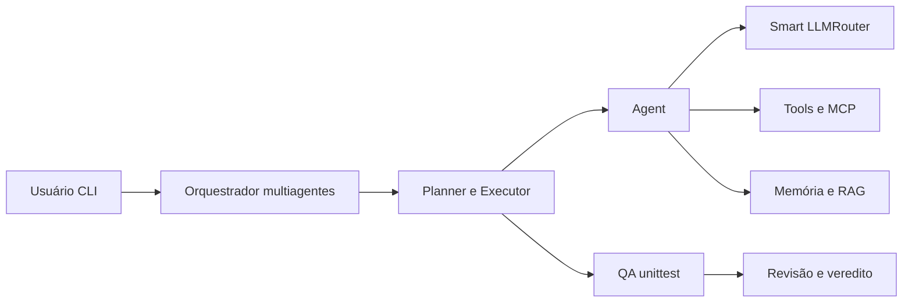

# Tesla Agent — da V0.1 à V0.6.0

**Agente de IA para desenvolvimento de software e automações, construído em Python com harness próprio.**

> **Criador:** **Guilherme Hendrik**  
> [GitHub](https://github.com/MrHendrix0611) · [LinkedIn](https://www.linkedin.com/in/guilherme-hendrik-59775326a/) · [Instagram](https://www.instagram.com/hxtech_/)

## Sobre o projeto

O projeto começou como **Hefesto Agent** (V0.1–V0.5.4) e passou a se chamar **Tesla Agent** a partir da V0.5.5. A evolução inclui CLI, modelos LLM, memória de sessão, Skills, ferramentas, permissões, seleção inteligente de modelos, controle de custos, auditoria, análise de repositórios, planejamento, edição de código, RAG, MCP e múltiplos agentes.

## Navegue pelas versões

| Versão | Destaque | Código e README |
|---|---|---|
| v0.1 | Fundação do agente e CLI | [Acessar v0.1](versions/v0.1/README.md) |
| v0.2 | Seleção de provedores | [Acessar v0.2](versions/v0.2/README.md) |
| v0.3 | Contexto conversacional | [Acessar v0.3](versions/v0.3/README.md) |
| v0.4 | Skills especializadas | [Acessar v0.4](versions/v0.4/README.md) |
| v0.5 | Tools, permissões e execução | [Acessar v0.5](versions/v0.5/README.md) |
| v0.5.1 | Multi-LLM e fallback | [Acessar v0.5.1](versions/v0.5.1/README.md) |
| v0.5.2 | Smart Router e controle de uso | [Acessar v0.5.2](versions/v0.5.2/README.md) |
| v0.5.3 | Aprovação de modelos pagos | [Acessar v0.5.3](versions/v0.5.3/README.md) |
| v0.5.4 | Observabilidade e auditoria | [Acessar v0.5.4](versions/v0.5.4/README.md) |
| v0.5.5 | Repository Intelligence — Tesla | [Acessar v0.5.5](versions/v0.5.5/README.md) |
| v0.5.6 | Planner, Executor e checkpoints | [Acessar v0.5.6](versions/v0.5.6/README.md) |
| v0.5.7 | Coding Agent: diff, rollback e testes | [Acessar v0.5.7](versions/v0.5.7/README.md) |
| v0.5.8 | Memória de projeto e RAG lexical | [Acessar v0.5.8](versions/v0.5.8/README.md) |
| v0.5.9 | Integração MCP via stdio | [Acessar v0.5.9](versions/v0.5.9/README.md) |
| v0.6.0 | Orquestração multiagentes | [Acessar v0.6.0](versions/v0.6.0/README.md) |

> Os diretórios contêm snapshots de código enviados pelo autor, com documentação atualizada para publicação. As tags e commits deste pacote, se utilizados, são **reconstruções retrospectivas**, não o histórico original de desenvolvimento.

## Executar a versão mais recente

```powershell
cd versions\v0.6.0
py -m pip install -r requirements.txt
Copy-Item .env.example .env
# Preencha suas chaves no .env local (nunca no GitHub).
py -m unittest discover -s tests -v
py -m cli.main
```

O repositório contém **código histórico de diferentes versões**: execute comandos a partir da pasta da versão desejada. O sucesso dos testes depende de dependências, sistema operacional e configuração do provedor; não significa que uma versão histórica esteja pronta para produção.

## Visão geral da arquitetura mais recente



## Publicação segura

- **Não inclua chaves de API:** use `.env.example` em cada versão e mantenha o `.env` somente local.
- **Não inclua dados de sessão:** logs, `.tesla/`, caches e arquivos de teste gerados foram removidos desta distribuição.
- **O código histórico pode conter limitações conhecidas:** confira os READMEs de versão e execute os testes antes de usar.
- **Licença:** não foi definida pelo criador. Antes de declarar o repositório como open source sob uma licença específica, adicione o arquivo `LICENSE` de sua escolha.

Consulte [CHANGELOG.md](CHANGELOG.md), [ROADMAP.md](ROADMAP.md), [SECURITY.md](SECURITY.md) e [GUIA_PUBLICACAO.md](GUIA_PUBLICACAO.md).
