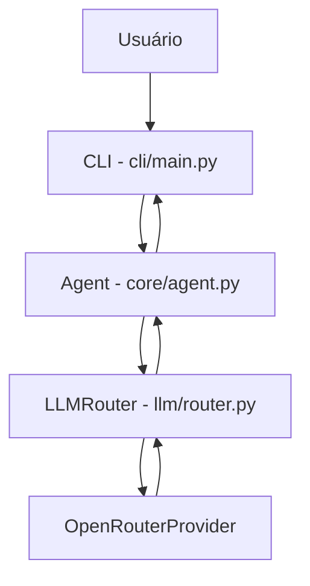
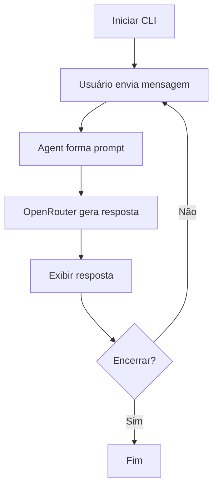

# Hefesto Agent V0.1 — Fundação do agente e CLI

> **Versão histórica** · [Índice de versões](../../README.md) · **Criador:** Guilherme Hendrik  
> [GitHub](https://github.com/MrHendrix0611) · [LinkedIn](https://www.linkedin.com/in/guilherme-hendrik-59775326a/) · [Instagram](https://www.instagram.com/hxtech_/)

## 1. Descrição

Primeira implementação do Hefesto: um assistente textual executado no terminal, com integração inicial ao OpenRouter.

## 2. Objetivo

Validar a estrutura mínima CLI → Agent → Router → LLM e responder mensagens do usuário.

## 3. Funcionalidades e implementações desta versão

- `cli/main.py` mantém um ciclo de leitura de mensagens e saída no console.
- `core/agent.py` monta um prompt inicial e solicita a resposta ao `LLMRouter`.
- `llm/router.py` utiliza o provedor OpenRouter como rota única.
- `core/context.py` define uma estrutura simples de mensagens, ainda não integrada à execução do agente.

### Principais arquivos e responsabilidades

- `cli/main.py` — prompt/saída do terminal
- `core/agent.py` — construção da solicitação
- `llm/router.py` — seleção do provedor
- `llm/providers/` — comunicação com LLM

## 4. Instalação e execução

Requisitos: Python 3 e acesso ao provedor configurado (se for remoto). Execute os comandos a partir desta pasta de versão, não da raiz do repositório:

```powershell
py -m pip install -r requirements.txt
Copy-Item .env.example .env
# Edite .env apenas em sua máquina e preencha as chaves necessárias.
py -m cli.main
```

O arquivo `.env.example` contém somente exemplos sem credenciais reais. Para modelos locais, configure o Ollama quando a versão o permitir. Identificadores de modelos antigos podem não estar disponíveis hoje.

## 5. Comandos disponíveis

| Comando | Finalidade |
|---|---|
| `sair` / `exit` / `quit` | Encerra o CLI. |
| `<mensagem>` | Envia uma pergunta ao modelo. |

**Observação:** comandos de barra só devem ser usados dentro da CLI do Hefesto, após aparecer `Você:`. Mensagens comuns são encaminhadas ao modelo. Não execute comandos desconhecidos sem revisar permissões.

## 6. Fluxograma da arquitetura



## 7. Fluxograma de funcionamento



## 8. Limitações e pontos de atenção

- Nesta versão, não há Skills, Tools, planejamento nem memória integrada à conversa.

O código desta versão foi preservado como snapshot histórico. A documentação foi reescrita a partir dos arquivos fornecidos; não houve mudanças funcionais planejadas no snapshot. Nesta fase, os módulos têm escopo pequeno e alguns arquivos são apenas scaffolding.

## 9. Implementações e objetivos da próxima versão

**Próxima etapa:** [`v0.2`](../v0.2/README.md).

- Adicionar seleção de provedor por configuração.
- Permitir alternar entre OpenRouter e Ollama local.

## 10. Segurança, autoria e contribuição

- **Criador e responsável pelo projeto:** **Guilherme Hendrik**.
- GitHub: https://github.com/MrHendrix0611
- LinkedIn: https://www.linkedin.com/in/guilherme-hendrik-59775326a/
- Instagram: https://www.instagram.com/hxtech_/
- Nunca publique `.env`, credenciais, logs de uso ou checkpoints pessoais.
- Versões históricas são disponibilizadas para estudo da evolução; não devem ser presumidas seguras para produção.
- Para informações sobre publicação e segurança, consulte [`SECURITY.md`](../../SECURITY.md).
