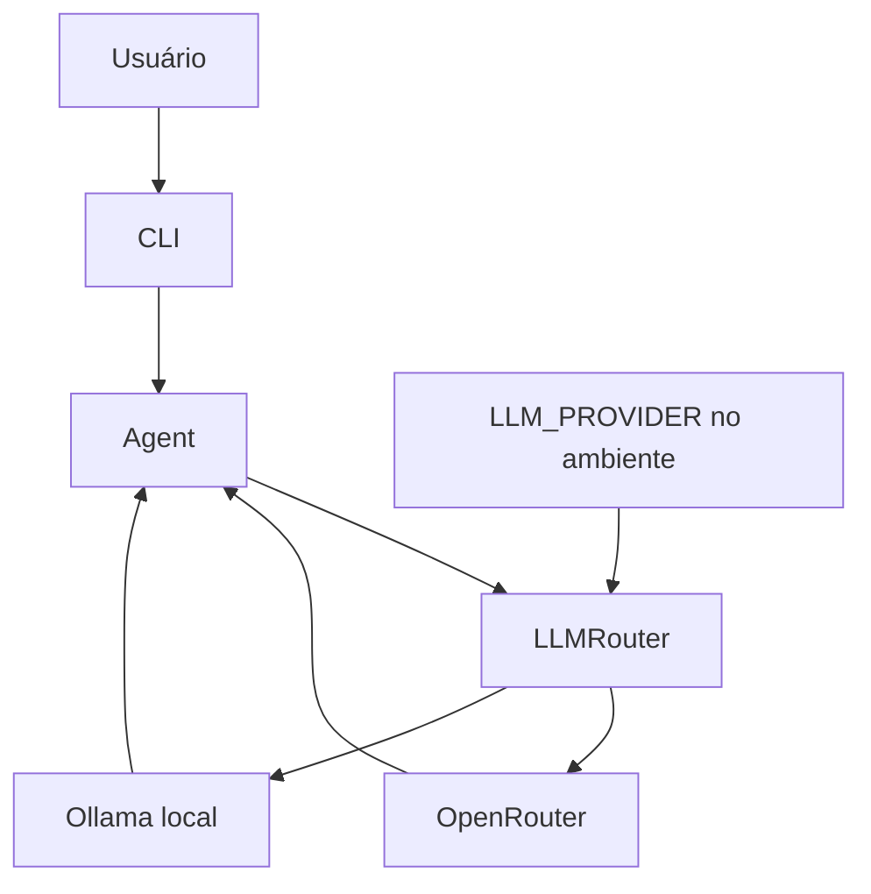
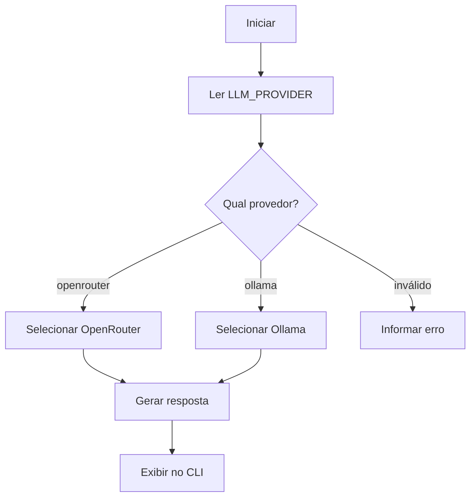

# Hefesto Agent V0.2 — Seleção de provedores

> **Versão histórica** · [Índice de versões](../../README.md) · **Criador:** Guilherme Hendrik  
> [GitHub](https://github.com/MrHendrix0611) · [LinkedIn](https://www.linkedin.com/in/guilherme-hendrik-59775326a/) · [Instagram](https://www.instagram.com/hxtech_/)

## 1. Descrição

Evolução do roteador de LLMs para selecionar o OpenRouter ou o Ollama por variável de ambiente.

## 2. Objetivo

Desacoplar o agente de um único backend de geração de texto.

## 3. Funcionalidades e implementações desta versão

- `llm/router.py` lê `LLM_PROVIDER` do ambiente com `python-dotenv`.
- Suporte à seleção explícita de `openrouter` e `ollama`.
- Erros são apresentados para provedores não suportados.
- O CLI e o agente permanecem essencialmente iguais aos da V0.1.

### Principais arquivos e responsabilidades

- `llm/router.py` — seleção do provedor
- `llm/providers/` — backends de inferência
- `core/agent.py` — respostas conversacionais

## 4. Instalação e execução

Requisitos: Python 3 e acesso ao provedor configurado (se for remoto). Execute os comandos a partir desta pasta de versão, não da raiz do repositório:

```powershell
py -m pip install -r requirements.txt
Copy-Item .env.example .env
# Edite .env apenas em sua máquina e preencha as chaves necessárias.
py -m cli.main
```

O arquivo `.env.example` contém somente exemplos sem credenciais reais. Para modelos locais, configure o Ollama quando a versão o permitir. Identificadores de modelos antigos podem não estar disponíveis hoje.

## 5. Comandos disponíveis

| Comando | Finalidade |
|---|---|
| `sair` / `exit` / `quit` | Encerra o CLI. |
| `<mensagem>` | Conversa usando o provedor selecionado no ambiente. |

**Observação:** comandos de barra só devem ser usados dentro da CLI do Hefesto, após aparecer `Você:`. Mensagens comuns são encaminhadas ao modelo. Não execute comandos desconhecidos sem revisar permissões.

## 6. Fluxograma da arquitetura



## 7. Fluxograma de funcionamento



## 8. Limitações e pontos de atenção

- A seleção depende do ambiente; ainda não há fallback automático nem roteamento por tipo de tarefa.
- O banner histórico do CLI ainda exibe V0.1.

O código desta versão foi preservado como snapshot histórico. A documentação foi reescrita a partir dos arquivos fornecidos; não houve mudanças funcionais planejadas no snapshot. Nesta fase, os módulos têm escopo pequeno e alguns arquivos são apenas scaffolding.

## 9. Implementações e objetivos da próxima versão

**Próxima etapa:** [`v0.3`](../v0.3/README.md).

- Integrar histórico de mensagens à geração.
- Separar o prompt de sistema da conversa.

## 10. Segurança, autoria e contribuição

- **Criador e responsável pelo projeto:** **Guilherme Hendrik**.
- GitHub: https://github.com/MrHendrix0611
- LinkedIn: https://www.linkedin.com/in/guilherme-hendrik-59775326a/
- Instagram: https://www.instagram.com/hxtech_/
- Nunca publique `.env`, credenciais, logs de uso ou checkpoints pessoais.
- Versões históricas são disponibilizadas para estudo da evolução; não devem ser presumidas seguras para produção.
- Para informações sobre publicação e segurança, consulte [`SECURITY.md`](../../SECURITY.md).
