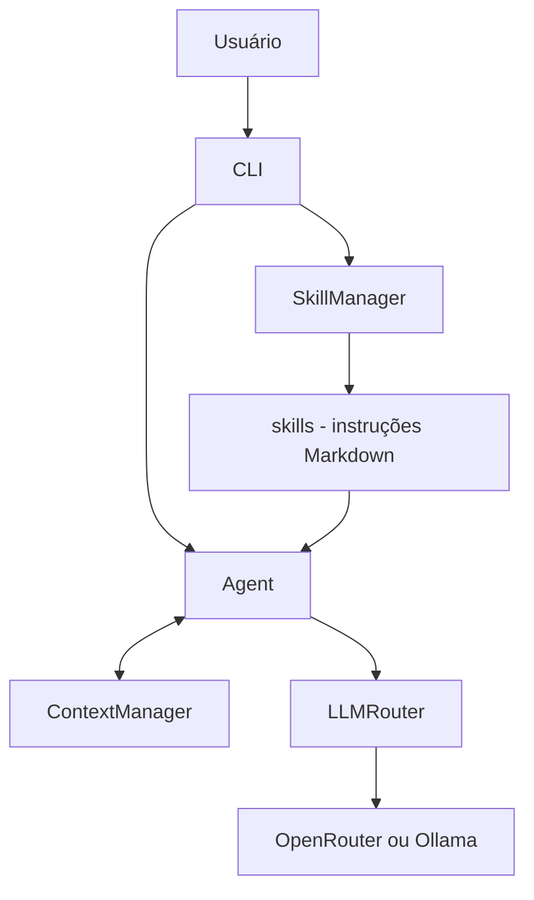
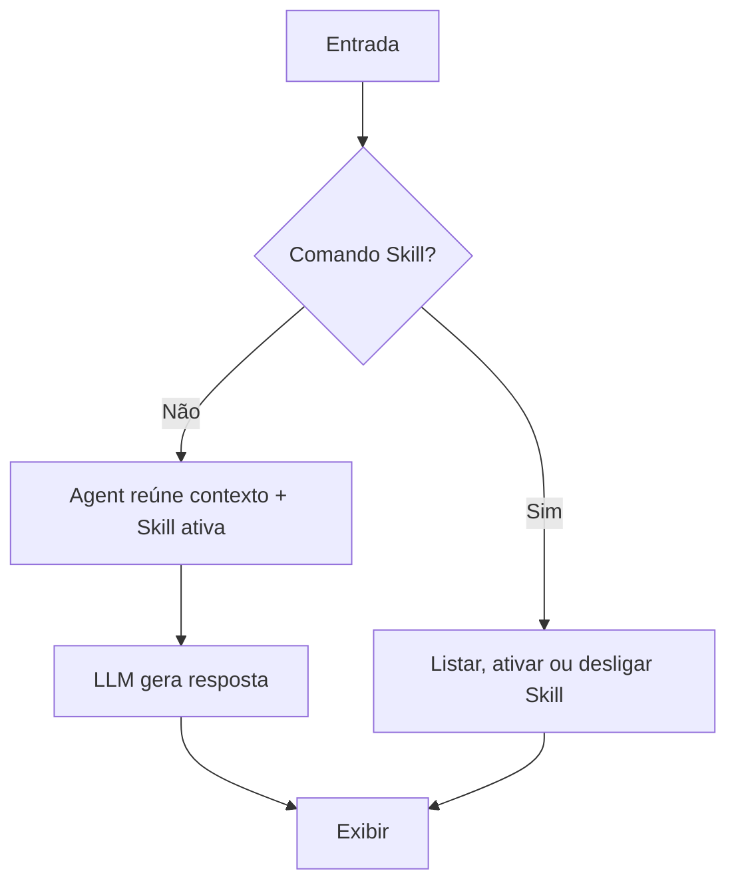

# Hefesto Agent V0.4 — Skills especializadas

> **Versão histórica** · [Índice de versões](../../README.md) · **Criador:** Guilherme Hendrik  
> [GitHub](https://github.com/MrHendrix0611) · [LinkedIn](https://www.linkedin.com/in/guilherme-hendrik-59775326a/) · [Instagram](https://www.instagram.com/hxtech_/)

## 1. Descrição

Adição de instruções especializadas selecionáveis em tempo de execução.

## 2. Objetivo

Tornar o agente extensível para tarefas de arquitetura, programação e QA.

## 3. Funcionalidades e implementações desta versão

- `core/skill_manager.py` lista e carrega instruções de Skills.
- As pastas `skills/architecture`, `skills/coding` e `skills/qa` contêm instruções.
- O agente injeta o texto da Skill ativa no contexto.
- Comandos de CLI para listar, ativar e desativar Skills.

### Principais arquivos e responsabilidades

- `core/skill_manager.py` — gerenciamento de Skills
- `skills/` — instruções por domínio
- `core/context.py` — histórico
- `core/agent.py` — integração das instruções

## 4. Instalação e execução

Requisitos: Python 3 e acesso ao provedor configurado (se for remoto). Execute os comandos a partir desta pasta de versão, não da raiz do repositório:

```powershell
py -m pip install -r requirements.txt
Copy-Item .env.example .env
# Edite .env apenas em sua máquina e preencha as chaves necessárias.
py -m cli.main
```

O arquivo `.env.example` contém somente exemplos sem credenciais reais. Para modelos locais, configure o Ollama quando a versão o permitir. Identificadores de modelos antigos podem não estar disponíveis hoje.

## 5. Comandos disponíveis

| Comando | Finalidade |
|---|---|
| `/skills` | Lista Skills disponíveis. |
| `/skill <nome>` | Ativa uma Skill. |
| `/skill off` | Desativa a Skill. |
| `/skill` | Consulta a Skill ativa. |
| `/sair` | Encerra a execução. |

**Observação:** comandos de barra só devem ser usados dentro da CLI do Hefesto, após aparecer `Você:`. Mensagens comuns são encaminhadas ao modelo. Não execute comandos desconhecidos sem revisar permissões.

## 6. Fluxograma da arquitetura



## 7. Fluxograma de funcionamento



## 8. Limitações e pontos de atenção

- A V0.4 não inclui ainda `tools/registry.py` nem execução de ferramentas por tool calling.

O código desta versão foi preservado como snapshot histórico. A documentação foi reescrita a partir dos arquivos fornecidos; não houve mudanças funcionais planejadas no snapshot.

## 9. Implementações e objetivos da próxima versão

**Próxima etapa:** [`v0.5`](../v0.5/README.md).

- Implementar registro de Tools e tool calling.
- Criar permissões para comandos sensíveis de terminal.

## 10. Segurança, autoria e contribuição

- **Criador e responsável pelo projeto:** **Guilherme Hendrik**.
- GitHub: https://github.com/MrHendrix0611
- LinkedIn: https://www.linkedin.com/in/guilherme-hendrik-59775326a/
- Instagram: https://www.instagram.com/hxtech_/
- Nunca publique `.env`, credenciais, logs de uso ou checkpoints pessoais.
- Versões históricas são disponibilizadas para estudo da evolução; não devem ser presumidas seguras para produção.
- Para informações sobre publicação e segurança, consulte [`SECURITY.md`](../../SECURITY.md).
