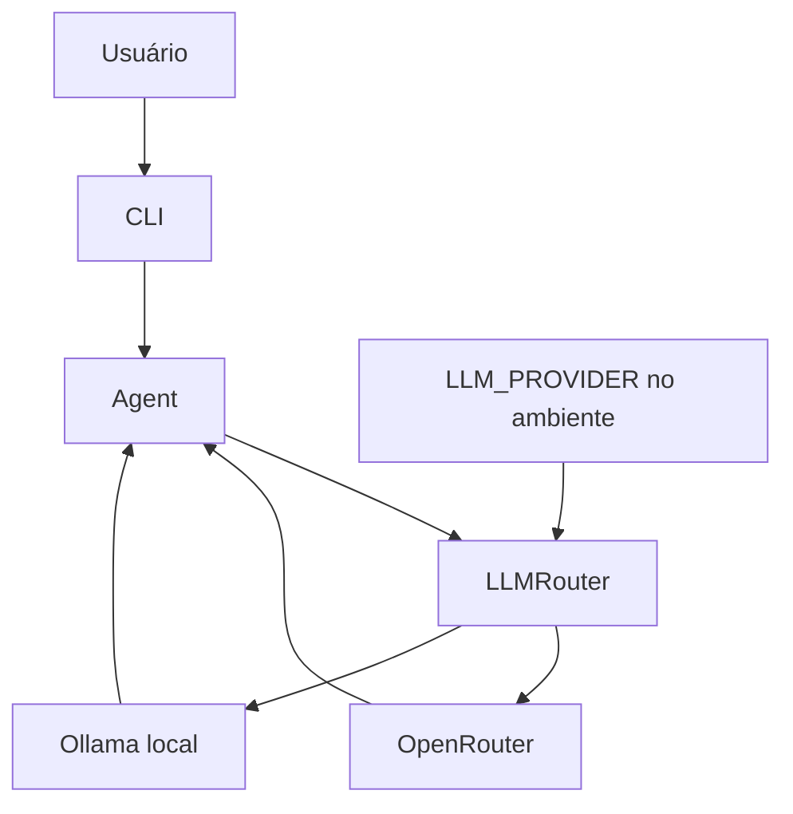
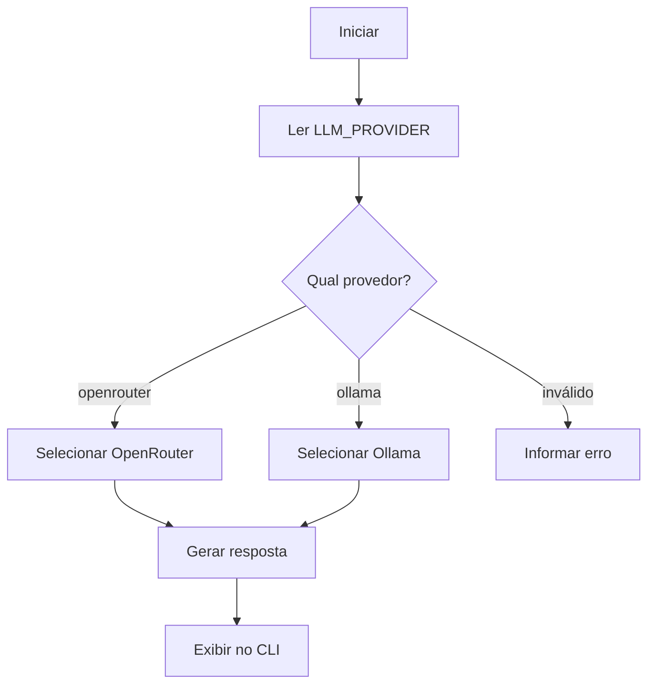

# Hefesto Agent V0.5.1 — Multi-LLM e fallback

> **Versão histórica** · [Índice de versões](../../README.md) · **Criador:** Guilherme Hendrik  
> [GitHub](https://github.com/MrHendrix0611) · [LinkedIn](https://www.linkedin.com/in/guilherme-hendrik-59775326a/) · [Instagram](https://www.instagram.com/hxtech_/)

## 1. Descrição

Integração de provedores externos adicionais ao roteador do Hefesto.

## 2. Objetivo

Reduzir dependência de uma única API e ampliar opções de modelos gratuitos.

## 3. Funcionalidades e implementações desta versão

- Provedores `Groq`, `Gemini`, `OpenRouter` e `Ollama` no diretório `llm/providers/`.
- Configuração por `.env.example` com ordem de fallback.
- Roteador aceita modo automático com sequência configurável de provedores.
- Tools e permissões são preservadas da base anterior.

### Principais arquivos e responsabilidades

- `llm/router.py` — seleção do provedor
- `llm/providers/` — backends de inferência
- `core/agent.py` — respostas conversacionais

## 4. Instalação e execução

Requisitos: Python 3 e acesso ao provedor configurado (se for remoto). Execute os comandos a partir desta pasta de versão, não da raiz do repositório:

```powershell
py -m pip install -r requirements.txt
Copy-Item .env.example .env
# Edite .env apenas em sua máquina e preencha as chaves necessárias.
py -m cli.main
```

O arquivo `.env.example` contém somente exemplos sem credenciais reais. Para modelos locais, configure o Ollama quando a versão o permitir. Identificadores de modelos antigos podem não estar disponíveis hoje.

## 5. Comandos disponíveis

| Comando | Finalidade |
|---|---|
| `/skills` | Lista Skills. |
| `/skill <nome>` | Ativa Skill. |
| `/skill off` | Desativa Skill. |
| `/tools` | Lista as famílias de ferramentas. |
| `/sair` | Encerra. |

**Observação:** comandos de barra só devem ser usados dentro da CLI do Hefesto, após aparecer `Você:`. Mensagens comuns são encaminhadas ao modelo. Não execute comandos desconhecidos sem revisar permissões.

## 6. Fluxograma da arquitetura



## 7. Fluxograma de funcionamento



## 8. Limitações e pontos de atenção

- Esta versão veio no ZIP original com código aninhado sob `hefesto_v0.6/`; ele foi normalizado para o diretório `v0.5.1/` nesta cópia pública.
- Não há classificação de tarefa no roteador desta versão.

O código desta versão foi preservado como snapshot histórico. A documentação foi reescrita a partir dos arquivos fornecidos; não houve mudanças funcionais planejadas no snapshot.

## 9. Implementações e objetivos da próxima versão

**Próxima etapa:** [`v0.5.2`](../v0.5.2/README.md).

- Implementar seleção inteligente por categoria de solicitação.
- Rastrear consumo e cooldown de provedores.

## 10. Segurança, autoria e contribuição

- **Criador e responsável pelo projeto:** **Guilherme Hendrik**.
- GitHub: https://github.com/MrHendrix0611
- LinkedIn: https://www.linkedin.com/in/guilherme-hendrik-59775326a/
- Instagram: https://www.instagram.com/hxtech_/
- Nunca publique `.env`, credenciais, logs de uso ou checkpoints pessoais.
- Versões históricas são disponibilizadas para estudo da evolução; não devem ser presumidas seguras para produção.
- Para informações sobre publicação e segurança, consulte [`SECURITY.md`](../../SECURITY.md).
