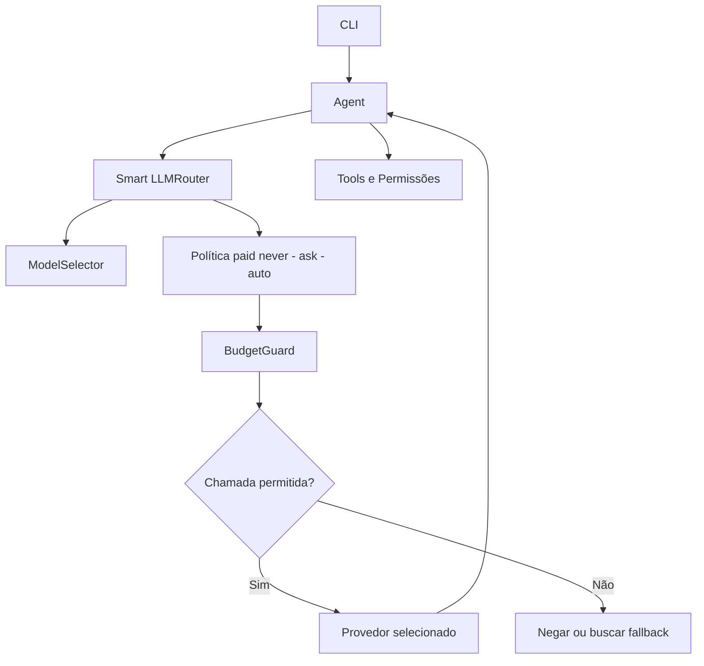
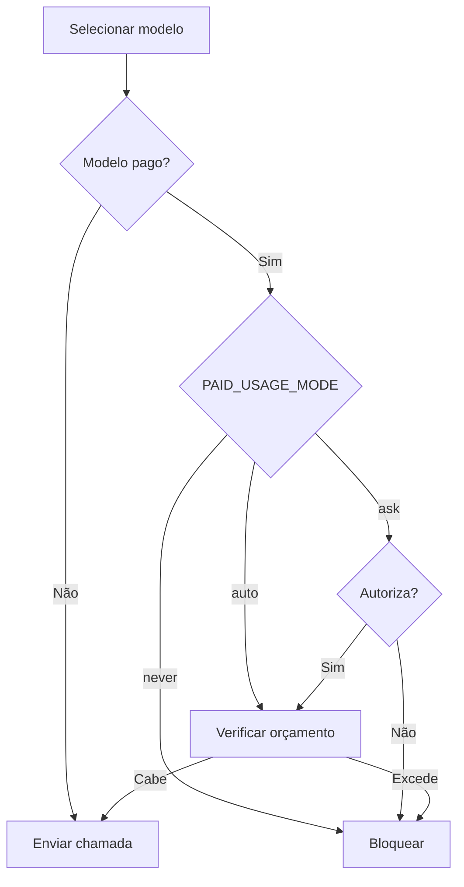

# Hefesto Agent V0.5.3 — Aprovação de modelos pagos

> **Versão histórica** · [Índice de versões](../../README.md) · **Criador:** Guilherme Hendrik  
> [GitHub](https://github.com/MrHendrix0611) · [LinkedIn](https://www.linkedin.com/in/guilherme-hendrik-59775326a/) · [Instagram](https://www.instagram.com/hxtech_/)

## 1. Descrição

Governança de custos para chamadas de modelos pagos.

## 2. Objetivo

Impedir consumo pago sem a política de autorização escolhida.

## 3. Funcionalidades e implementações desta versão

- Política `PAID_USAGE_MODE=never|ask|auto` com tratamento conservador de valores inválidos.
- O modo `ask` solicita autorização antes da chamada.
- `MONTHLY_PAID_BUDGET_USD` e `BudgetGuard` para limites locais estimados.
- Comando `/paid` para consultar a configuração.

### Principais arquivos e responsabilidades

- `llm/intelligence.py` — BudgetGuard
- `llm/router.py` — política paid e fallback
- `cli/main.py` — confirmação de pagamento

## 4. Instalação e execução

Requisitos: Python 3 e acesso ao provedor configurado (se for remoto). Execute os comandos a partir desta pasta de versão, não da raiz do repositório:

```powershell
py -m pip install -r requirements.txt
Copy-Item .env.example .env
# Edite .env apenas em sua máquina e preencha as chaves necessárias.
py -m cli.main
```

O arquivo `.env.example` contém somente exemplos sem credenciais reais. Para modelos locais, configure o Ollama quando a versão o permitir. Identificadores de modelos antigos podem não estar disponíveis hoje.

## 5. Comandos disponíveis

| Comando | Finalidade |
|---|---|
| `/skills` | Lista Skills. |
| `/skill <nome>` | Ativa Skill. |
| `/skill off` | Desativa Skill. |
| `/tools` | Lista as famílias de ferramentas. |
| `/sair` | Encerra. |
| `/router` | Mostra a decisão do roteador. |
| `/usage` | Exibe o uso local. |
| `/paid` | Exibe modo de uso pago e orçamento. |

**Observação:** comandos de barra só devem ser usados dentro da CLI do Hefesto, após aparecer `Você:`. Mensagens comuns são encaminhadas ao modelo. Não execute comandos desconhecidos sem revisar permissões.

## 6. Fluxograma da arquitetura



## 7. Fluxograma de funcionamento



## 8. Limitações e pontos de atenção

- Controle de orçamento é local e baseado em estimativas; limites reais dependem do provedor.

O código desta versão foi preservado como snapshot histórico. A documentação foi reescrita a partir dos arquivos fornecidos; não houve mudanças funcionais planejadas no snapshot.

## 9. Implementações e objetivos da próxima versão

**Próxima etapa:** [`v0.5.4`](../v0.5.4/README.md).

- Adicionar auditoria estruturada, métricas e falhas de fallback.
- Criar comandos de estatísticas e logs redigidos.

## 10. Segurança, autoria e contribuição

- **Criador e responsável pelo projeto:** **Guilherme Hendrik**.
- GitHub: https://github.com/MrHendrix0611
- LinkedIn: https://www.linkedin.com/in/guilherme-hendrik-59775326a/
- Instagram: https://www.instagram.com/hxtech_/
- Nunca publique `.env`, credenciais, logs de uso ou checkpoints pessoais.
- Versões históricas são disponibilizadas para estudo da evolução; não devem ser presumidas seguras para produção.
- Para informações sobre publicação e segurança, consulte [`SECURITY.md`](../../SECURITY.md).
