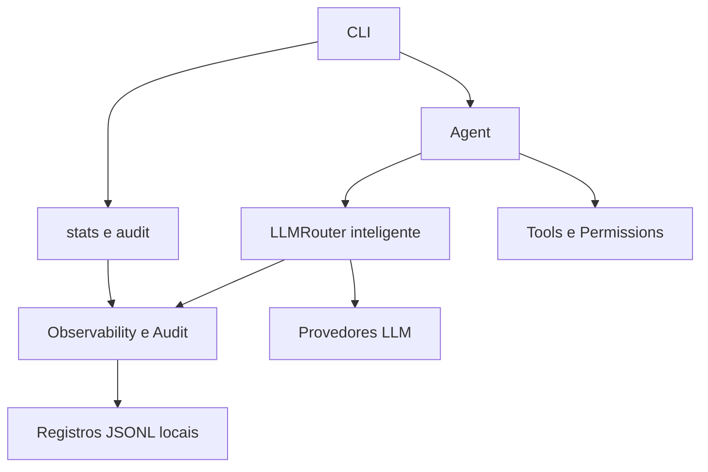
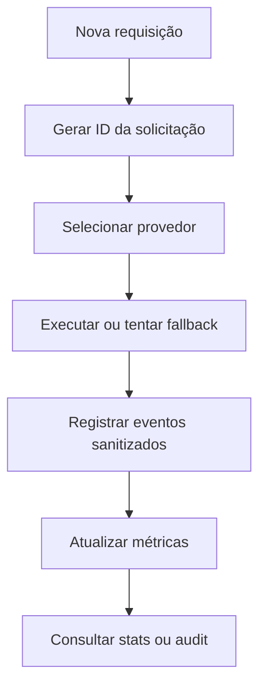

# Hefesto Agent V0.5.4 — Observabilidade e auditoria

> **Versão histórica** · [Índice de versões](../../README.md) · **Criador:** Guilherme Hendrik  
> [GitHub](https://github.com/MrHendrix0611) · [LinkedIn](https://www.linkedin.com/in/guilherme-hendrik-59775326a/) · [Instagram](https://www.instagram.com/hxtech_/)

## 1. Descrição

Instrumentação de decisões do roteador e consumo do agente.

## 2. Objetivo

Facilitar diagnósticos de erro, escolhas de modelo e uso das APIs.

## 3. Funcionalidades e implementações desta versão

- `llm/observability.py` inclui registros de auditoria e relatórios.
- Identificadores de requisição, falhas e eventos de fallback.
- Comandos `/stats` e `/audit`.
- Persistência de eventos em JSONL local.

### Principais arquivos e responsabilidades

- `llm/observability.py` — auditoria
- `llm/router.py` — emissão de eventos
- `cli/main.py` — relatórios

## 4. Instalação e execução

Requisitos: Python 3 e acesso ao provedor configurado (se for remoto). Execute os comandos a partir desta pasta de versão, não da raiz do repositório:

```powershell
py -m pip install -r requirements.txt
Copy-Item .env.example .env
# Edite .env apenas em sua máquina e preencha as chaves necessárias.
py -m cli.main
```

O arquivo `.env.example` contém somente exemplos sem credenciais reais. Para modelos locais, configure o Ollama quando a versão o permitir. Identificadores de modelos antigos podem não estar disponíveis hoje.

## 5. Comandos disponíveis

| Comando | Finalidade |
|---|---|
| `/skills` | Lista Skills. |
| `/skill <nome>` | Ativa Skill. |
| `/skill off` | Desativa Skill. |
| `/tools` | Lista as famílias de ferramentas. |
| `/sair` | Encerra. |
| `/router` | Mostra a decisão do roteador. |
| `/usage` | Exibe o uso local. |
| `/paid` | Exibe modo de uso pago e orçamento. |
| `/stats` | Relatório agregado de uso e falhas. |
| `/audit` | Histórico de eventos do roteador. |

**Observação:** comandos de barra só devem ser usados dentro da CLI do Hefesto, após aparecer `Você:`. Mensagens comuns são encaminhadas ao modelo. Não execute comandos desconhecidos sem revisar permissões.

## 6. Fluxograma da arquitetura



## 7. Fluxograma de funcionamento



## 8. Limitações e pontos de atenção

- Registros e relatórios não garantem equivalência com cobrança real de tokens.
- Arquivos JSONL de execução foram excluídos da cópia pública.

O código desta versão foi preservado como snapshot histórico. A documentação foi reescrita a partir dos arquivos fornecidos; não houve mudanças funcionais planejadas no snapshot.

## 9. Implementações e objetivos da próxima versão

**Próxima etapa:** [`v0.5.5`](../v0.5.5/README.md).

- Adicionar mapeamento de projetos e busca de símbolos.
- Facilitar consultas sobre código real de repositórios.

## 10. Segurança, autoria e contribuição

- **Criador e responsável pelo projeto:** **Guilherme Hendrik**.
- GitHub: https://github.com/MrHendrix0611
- LinkedIn: https://www.linkedin.com/in/guilherme-hendrik-59775326a/
- Instagram: https://www.instagram.com/hxtech_/
- Nunca publique `.env`, credenciais, logs de uso ou checkpoints pessoais.
- Versões históricas são disponibilizadas para estudo da evolução; não devem ser presumidas seguras para produção.
- Para informações sobre publicação e segurança, consulte [`SECURITY.md`](../../SECURITY.md).
