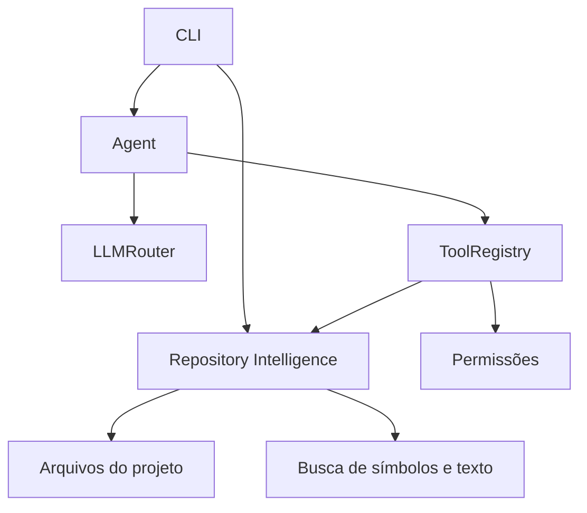
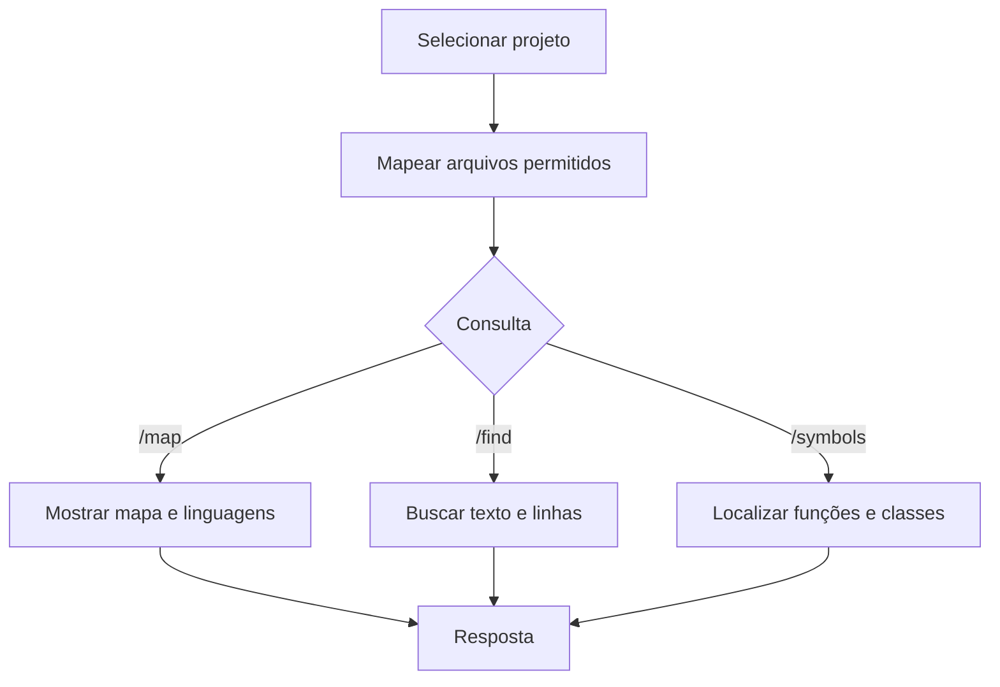

# Tesla Agent V0.5.5 — Repository Intelligence — Tesla

> **Versão histórica** · [Índice de versões](../../README.md) · **Criador:** Guilherme Hendrik  
> [GitHub](https://github.com/MrHendrix0611) · [LinkedIn](https://www.linkedin.com/in/guilherme-hendrik-59775326a/) · [Instagram](https://www.instagram.com/hxtech_/)

## 1. Descrição

Primeira versão do agente com a marca Tesla e funcionalidades de exploração de código.

## 2. Objetivo

Transformar o agente em assistente capaz de navegar pelo código real do projeto.

## 3. Funcionalidades e implementações desta versão

- `tools/repository.py` implementa mapeamento de repositório e pesquisa de código.
- Busca por símbolos (funções e classes) e por ocorrências com números de linha.
- CLI inclui `/project`, `/map`, `/find` e `/symbols`.
- O registro passa a expor operações de escrita de arquivo na variante presente neste snapshot.

### Principais arquivos e responsabilidades

- `tools/repository.py` — mapa, busca e símbolos
- `tools/registry.py` — expõe ferramentas
- `cli/main.py` — comandos de projeto

## 4. Instalação e execução

Requisitos: Python 3 e acesso ao provedor configurado (se for remoto). Execute os comandos a partir desta pasta de versão, não da raiz do repositório:

```powershell
py -m pip install -r requirements.txt
Copy-Item .env.example .env
# Edite .env apenas em sua máquina e preencha as chaves necessárias.
py -m cli.main
```

O arquivo `.env.example` contém somente exemplos sem credenciais reais. Para modelos locais, configure o Ollama quando a versão o permitir. Identificadores de modelos antigos podem não estar disponíveis hoje.

## 5. Comandos disponíveis

| Comando | Finalidade |
|---|---|
| `/skills` | Lista Skills. |
| `/skill <nome>` | Ativa Skill. |
| `/skill off` | Desativa Skill. |
| `/tools` | Lista as famílias de ferramentas. |
| `/sair` | Encerra. |
| `/router` | Mostra a decisão do roteador. |
| `/usage` | Exibe o uso local. |
| `/paid` | Exibe modo de uso pago e orçamento. |
| `/stats` | Relatório agregado de uso e falhas. |
| `/audit` | Histórico de eventos do roteador. |
| `/project <caminho>` | Seleciona pasta do projeto. |
| `/map` | Resume o repositório. |
| `/find <texto>` | Localiza ocorrências no código. |
| `/symbols [termo]` | Lista funções/classes ou filtra por nome. |

**Observação:** comandos de barra só devem ser usados dentro da CLI do Tesla, após aparecer `Você:`. Mensagens comuns são encaminhadas ao modelo. Não execute comandos desconhecidos sem revisar permissões.

## 6. Fluxograma da arquitetura



## 7. Fluxograma de funcionamento



## 8. Limitações e pontos de atenção

- Busca de símbolos é heurística e não substitui análise semântica completa da linguagem.
- Durante os testes históricos houve respostas apoiadas em contexto desatualizado.

O código desta versão foi preservado como snapshot histórico. A documentação foi reescrita a partir dos arquivos fornecidos; não houve mudanças funcionais planejadas no snapshot.

## 9. Implementações e objetivos da próxima versão

**Próxima etapa:** [`v0.5.6`](../v0.5.6/README.md).

- Introduzir planos com dependências, checkpoints e execução por etapas.
- Garantir rastreamento de conclusão de etapas.

## 10. Segurança, autoria e contribuição

- **Criador e responsável pelo projeto:** **Guilherme Hendrik**.
- GitHub: https://github.com/MrHendrix0611
- LinkedIn: https://www.linkedin.com/in/guilherme-hendrik-59775326a/
- Instagram: https://www.instagram.com/hxtech_/
- Nunca publique `.env`, credenciais, logs de uso ou checkpoints pessoais.
- Versões históricas são disponibilizadas para estudo da evolução; não devem ser presumidas seguras para produção.
- Para informações sobre publicação e segurança, consulte [`SECURITY.md`](../../SECURITY.md).
