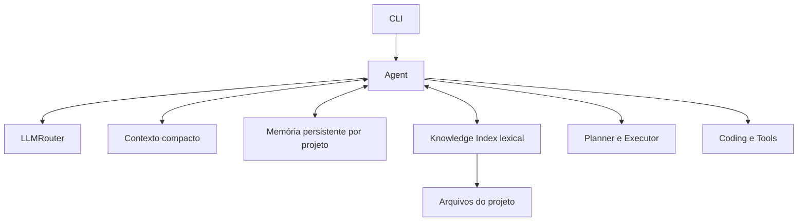
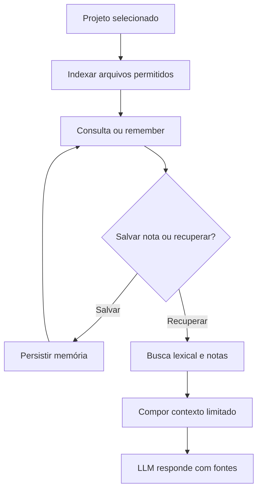

# Tesla Agent V0.5.8 — Memória de projeto e RAG lexical

> **Versão histórica** · [Índice de versões](../../README.md) · **Criador:** Guilherme Hendrik  
> [GitHub](https://github.com/MrHendrix0611) · [LinkedIn](https://www.linkedin.com/in/guilherme-hendrik-59775326a/) · [Instagram](https://www.instagram.com/hxtech_/)

## 1. Descrição

Persistência de notas e recuperação local de trechos relevantes de código.

## 2. Objetivo

Reduzir perda de contexto e permitir consultas fundamentadas nos arquivos atuais.

## 3. Funcionalidades e implementações desta versão

- `core/memory.py` armazena notas explícitas do projeto.
- `core/knowledge.py` constrói índice lexical dos arquivos permitidos.
- Indexação incremental, recuperação de trechos e histórico compacto.
- CLI inclui `/index`, `/recall`, `/remember`, `/memories`, `/forget`, `/context` e `/clearcontext`.

### Principais arquivos e responsabilidades

- `core/memory.py` — notas persistentes
- `core/knowledge.py` — RAG lexical
- `core/context.py` — histórico compacto
- `core/agent.py` — contexto recuperado

## 4. Instalação e execução

Requisitos: Python 3 e acesso ao provedor configurado (se for remoto). Execute os comandos a partir desta pasta de versão, não da raiz do repositório:

```powershell
py -m pip install -r requirements.txt
Copy-Item .env.example .env
# Edite .env apenas em sua máquina e preencha as chaves necessárias.
py -m cli.main
```

O arquivo `.env.example` contém somente exemplos sem credenciais reais. Para modelos locais, configure o Ollama quando a versão o permitir. Identificadores de modelos antigos podem não estar disponíveis hoje.

## 5. Comandos disponíveis

| Comando | Finalidade |
|---|---|
| `/skills` | Lista Skills. |
| `/skill <nome>` | Ativa Skill. |
| `/skill off` | Desativa Skill. |
| `/tools` | Lista as famílias de ferramentas. |
| `/sair` | Encerra. |
| `/router` | Mostra a decisão do roteador. |
| `/usage` | Exibe o uso local. |
| `/paid` | Exibe modo de uso pago e orçamento. |
| `/stats` | Relatório agregado de uso e falhas. |
| `/audit` | Histórico de eventos do roteador. |
| `/project <caminho>` | Seleciona pasta do projeto. |
| `/map` | Resume o repositório. |
| `/find <texto>` | Localiza ocorrências no código. |
| `/symbols [termo]` | Lista funções/classes ou filtra por nome. |
| `/plan create <objetivo>` | Gera plano. |
| `/plan` | Consulta o plano. |
| `/steps` | Consulta etapas. |
| `/resume` | Executa/retoma etapas. |
| `/retry <id>` | Libera etapa pausada/falha. |
| `/cancel` | Cancela o plano. |
| `/workspace` | Exibe projeto ativo. |
| `/diff <arquivo>` | Mostra diferenças de arquivo. |
| `/rollback <arquivo>` | Restaura alterações anteriores. |
| `/test [módulo|all|discover]` | Executa testes reais. |
| `/diagnose` | Diagnóstico local sem credenciais. |
| `/index` | Atualiza índice lexical do projeto. |
| `/recall <tema>` | Busca fontes e notas. |
| `/remember <nota>` | Salva memória explícita. |
| `/memories` | Lista memórias. |
| `/forget <id>` | Exclui nota. |
| `/context` | Estatísticas de contexto. |
| `/clearcontext` | Limpa o histórico temporário. |

**Observação:** comandos de barra só devem ser usados dentro da CLI do Tesla, após aparecer `Você:`. Mensagens comuns são encaminhadas ao modelo. Não execute comandos desconhecidos sem revisar permissões.

## 6. Fluxograma da arquitetura



## 7. Fluxograma de funcionamento



## 8. Limitações e pontos de atenção

- RAG lexical não faz busca vetorial ou embeddings semânticos.
- Testes históricos registraram um planejamento inadequado para diretório vazio, depois ajustado.

O código desta versão foi preservado como snapshot histórico. A documentação foi reescrita a partir dos arquivos fornecidos; não houve mudanças funcionais planejadas no snapshot.

## 9. Implementações e objetivos da próxima versão

**Próxima etapa:** [`v0.5.9`](../v0.5.9/README.md).

- Integrar ferramentas externas pelo Model Context Protocol.
- Incluir descoberta e chamadas MCP com autorização.

## 10. Segurança, autoria e contribuição

- **Criador e responsável pelo projeto:** **Guilherme Hendrik**.
- GitHub: https://github.com/MrHendrix0611
- LinkedIn: https://www.linkedin.com/in/guilherme-hendrik-59775326a/
- Instagram: https://www.instagram.com/hxtech_/
- Nunca publique `.env`, credenciais, logs de uso ou checkpoints pessoais.
- Versões históricas são disponibilizadas para estudo da evolução; não devem ser presumidas seguras para produção.
- Para informações sobre publicação e segurança, consulte [`SECURITY.md`](../../SECURITY.md).
